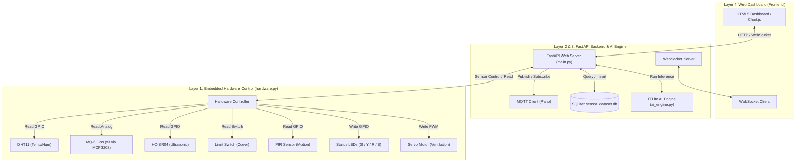
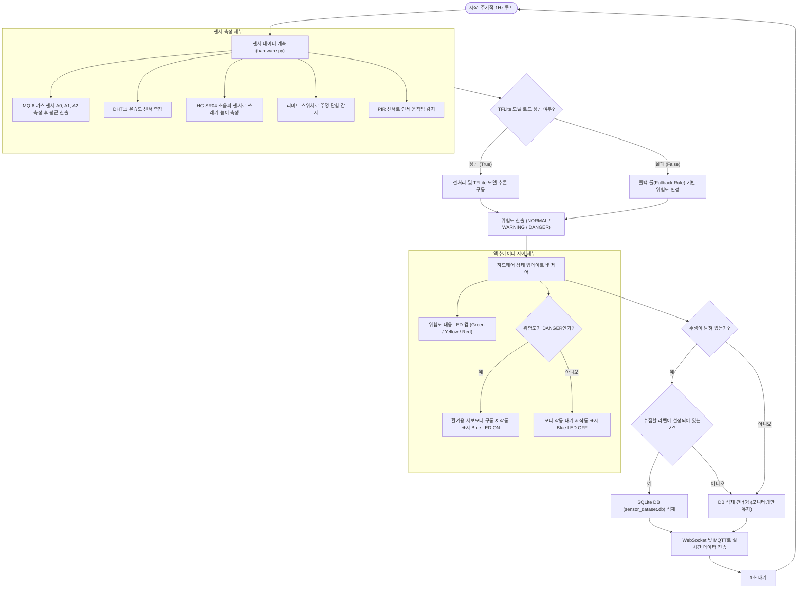

# Smart Eco-Bin: 시스템 아키텍처, 플로우차트 및 핀 맵 명세서

본 문서는 **Smart Eco-Bin** 지능형 AIoT 위생 관제 플랫폼의 시스템 설계, 데이터 흐름도(플로우차트) 및 하드웨어 인터페이스(핀 맵)에 대한 기술 명세서입니다.

---

## 🏗️ 1. 시스템 아키텍처 (System Architecture)

시스템은 하드웨어와 백엔드 서버 간의 완벽한 분리(Decoupling)와 모듈화를 지향합니다. 아래의 아키텍처 레이아웃은 데이터가 센서에서 수집되어 AI 추론과 웹 대시보드로 전달되는 물리적/논리적 경로를 도식화한 것입니다.

---

## 🔄 2. 데이터 흐름도 및 제어 루프 (Data Flow & Main Loop Flowchart)

백엔드 서버의 백그라운드 태스크는 **1Hz (1초당 1회)** 주기로 실행됩니다. 센서 수집부터 예외 처리, TFLite AI 추론, 제어 신호 출력, 데이터 저장 및 네트워크 송신까지의 전체 제어 루프는 다음과 같이 흐릅니다.

---

## 🔌 3. 하드웨어 핀 맵 (Hardware Pin Map)

본 시스템은 라즈베리파이 4와 12-bit ADC(MCP3208) 내장 쉴드 보드를 결합하여 작동합니다.

| 부품명 | 용도 | 연결 핀 (라즈베리파이/쉴드) | 입출력 구분 (I/O) | 설명 |
| :--- | :--- | :--- | :--- | :--- |
| **MQ-6 (A0)** | 부패 가스 및 악취 농도 측정 1 | `ADC Channel 0 (A0)` | Analog Input | SPI 기반 MCP3208 칩셋을 경유해 아날로그 전압 데이터 획득 |
| **MQ-6 (A1)** | 부패 가스 및 악취 농도 측정 2 | `ADC Channel 1 (A1)` | Analog Input | 다중 측정 평균을 내어 단일 센서의 오차 보정 |
| **MQ-6 (A2)** | 부패 가스 및 악취 농도 측정 3 | `ADC Channel 2 (A2)` | Analog Input | 다중 측정 평균을 내어 단일 센서의 오차 보정 |
| **DHT11** | 쓰레기통 내부 온습도 측정 | `GPIO 21` (Pin 40) | Digital I/O | 단일 데이터 선을 사용하는 1-Wire 방식 통신 |
| **HC-SR04 (Trig)** | 적재량 측정을 위한 거리 송신 | `GPIO 17` (Pin 11) | Digital Output | 10us의 초음파 발생 신호 송신 |
| **HC-SR04 (Echo)** | 적재량 측정을 위한 거리 수신 | `GPIO 18` (Pin 12) | Digital Input | 반사되어 돌아온 펄스 폭의 시간을 측정해 센티미터 단위 환산 |
| **Limit Switch** | 쓰레기통 뚜껑의 개폐 감지 | `GPIO 13` (Pin 33) | Digital Input | 내부 풀업(Pull-up) 저항 모드 사용. 안 눌렸을 때=닫힘 매핑 |
| **Servo Motor** | 강제 환기 댐퍼 작동 시연 | `GPIO 6` (Pin 31) | PWM Output | PWM 펄스 신호로 환기 댐퍼 모터 각도 제어 (최대 180도) |
| **PIR Sensor** | 인체 움직임 감지 | `GPIO 27` (Pin 13) | Digital Input | 인체 움직임 감지 시 서보모터 연동 구동 (90->0도, 4초 대기 후 복귀) |
| **LED Green** | 상태 표시: 정상 (NORMAL) | `GPIO 19` (Pin 35) | Digital Output | 위생상 쾌적하고 꽉 차지 않은 평온한 상태 알림 |
| **LED Yellow** | 상태 표시: 주의 (WARNING) | `GPIO 26` (Pin 37) | Digital Output | 가스가 증가하거나, 온도가 상승하여 부패가 우려되는 주의 알림 |
| **LED Red** | 상태 표시: 위험 (DANGER) | `GPIO 16` (Pin 36) | Digital Output | 부패 악취 가스가 높거나, 내부 온도가 위험하거나, 적재 완료된 상태 |
| **LED Blue** | 액추에이터 작동 확인 | `GPIO 20` (Pin 38) | Digital Output | 서보 모터 및 외부 환기 장치가 작동 중일 때 함께 점등 |
| **MCP3208 (ADC)** | 아날로그-디지털 변환 칩 | `SPI0 Bus` (CE0, MISO, MOSI, SCLK) | Bus Communication | CE0: `GPIO 8`, MISO: `GPIO 9`, MOSI: `GPIO 10`, SCLK: `GPIO 11` |

---

## 💡 주요 하드웨어 동작 설계 특징

1. **다중 센서 Latching (안정성)**:
   * 센서 계측 실패 시 일시적인 회로 노이즈에 대처하기 위해 직전에 읽은 성공값을 재사용(Latching)하여 시스템 오작동을 예방합니다.
2. **환기 모터 쿨다운 (Actuator Protection)**:
   * AI 판단에 의해 서보 모터(환기 댐퍼)가 작동된 후에는 **10초 간의 쿨다운 시간**을 부여하여 모터가 반복해서 고속으로 왕복 작동함으로써 파손되거나 노이즈가 누적되는 것을 방지합니다.
3. **뚜껑 개폐 연동 수집 필터링**:
   * 리미트 스위치를 통해 뚜껑이 열린 상태가 감지되면 사용자가 외부 쓰레기를 버리고 있는 상황으로 판단해, 급격히 변동되는 가스 및 거리를 DB 및 AI 학습 데이터 수집 대상에서 제외(오탐 방지)합니다.
